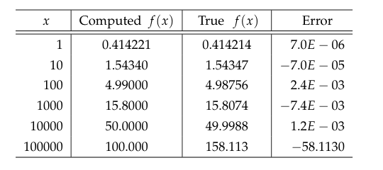
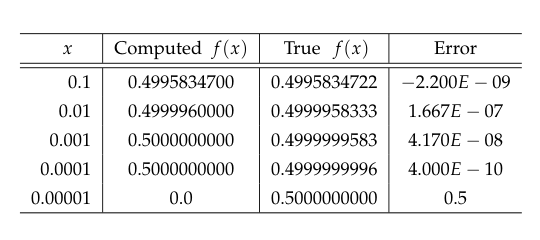

### Sect. 1 - Computer Arithmetic

Any nonzero decimal number $x$ :

$$
x = \sigma \cdot \bar{x} \cdot 10^e
$$

where 
$\sigma = \pm1$, $e \in \mathbb{Z}$, $1_{10} \leqslant \bar{x} \leqslant 10_{10}$
$\sigma$ is **sign**
$e$ is **exponent**
$\bar{x}$ is **mantissa** or **significant**

**Example 1** :

$$
27681.2 = (+1) \cdot 2.76812 \cdot 10^4 
$$

$\sigma = +1$
$\bar{x} = 2.76812$
$e = 4$

**Example 2** :

$$
-0.003134 = (-1) \cdot 3.134 \cdot 10^{-3} 
$$

$\sigma = -1$
$\bar{x} = 3.134$
$e = -3$

In the computer memory instead of storing the actual integer we store its values:
$e$, $\bar{x}$ and $e$ each of which has a fixed width

The number zero is represented uniquely by having both its **mantissa** and its **exponent** equal to **zero**

Formally, a floating point representation is characterized by four parameters: base $\beta$, which is a positive integer, precision $t$, which is the number of digits in mantissa, and the range for the exponent $e_\min ⩽e ⩽e_\max$. $t$ is precision.

$$
x = (\pm 1) \cdot \left(d_0 + \frac{d_1}{\beta} + \frac{d_2}{\beta^2} + \frac{d_3}{\beta^3} + \dots + \frac{d_t}{\beta^{t-1}}\right) \cdot \beta^e
$$

$$
x= (\pm 1) \cdot (d_0.d_1d_2d_3...d_t)_\beta \cdot \beta^e
$$

Today computers mostly use $(\beta = 2)$.

$$
x = \sigma \cdot \bar{x} \cdot 2^e
$$

**Example 1**
Let x = $(100101.011)_2$ Then the representation is:

$$
(100101.011)_2 = (+1)\cdot(1.00101011)_2\cdot2^{(101)_2}
$$

Consider the binary format for decimal number $(0.1)_{10} = (0.000110011001100\dots)_2$ the representation is :

$$
(0.000110011001100)_2 = (+1)\cdot(1.10011001100\dots)_2\cdot2^{(100)_2}
$$

Notice, that since $1_{10} \leqslant\bar{x}<(2)_{10}$, in the binary floating point representation the leading bit always equals 1.

IEEE SP, $e = 1$ bytes (8 bits), $t = 24 ,(23)$ bits and $\sigma = 1$ bit
IEEE DP, $e = 4$ bytes (32 bits), $t = 23$ bits and $\sigma = 1$ bit

### Sect. 1.1 IEEE SP Standard

$$
E = e + 127
$$

0 is stored in a special way:
$E = 0$
$\sigma = 0$
$\bar{x} = 0.00\dots$

$+\infty$ is sorted in a special way:
$E = 255$
$\sigma = 0$
$\bar{x} = 0.00\dots$

$-\infty$ is sorted in a special way:
$E = 255$
$\sigma = 1$
$\bar{x} = 0.00\dots$

*NaN* is sorted in a special way:
$E = 255$
$\bar{x} \neq 0.00\dots$
### Sect. 1.2 IEEE DP Standard

### Sect. 1.3 Accuracy of floating point representation

1. $0 < x \leq M$ and $x$ an integer implies $fl(x) = x$
2. $fl(M+1) \neq M+1$ 

For IEEE SP standard the integer M is $2^{24}$ because 

$$
2^{24} = (1.00\dots00)_2\cdot2^{24}
$$

Next integer $2^{24} + 1$ cannot be stored exactly since its mantissa will contain 24 + 1 binary digits:

$$
2^{24} + 1 = (1.\underbrace{00\dots0}_{23 \text{ zeros}}1)_2 \cdot 2^{24}
$$

For IEEE SP integer $M = 2^{24} = 16777216$ and for IEEE DP integer is $M = 2^{53} \approx 9.0 \cdot 10^{15}$ . 

Another parameter widely used to measure the accuracy of a floating point representation is the so-called **machine epsilon** $\Large{\varepsilon}$ , defined as the difference between 1 and the smallest number presentable in the machine arithmetic that is greater than 1.

$$
y = 1 + 23^{-23} = (1.\underbrace{00\dots0}_{22\text{ zeros}}1)_2 \cdot2^0 > 1
$$

and the machine epsilon in IEEE SP is:

$$
\varepsilon = y-1=2^{-23}\approx1.19\cdot10^{-7}
$$

In the case of IEEE double precision the machine epsilon is:

$$
\varepsilon = 2^{-52}\approx2.22\cdot10^{-16}
$$

### Sect. 1.4 Chopping and rounding

Let us first consider these concepts with decimal arithmetic. We write a computer floating point number $x$ and if precision $t = n$ (number of digits) we must shorten it to fit within the computer. This is done by either **chopping** or **rounding**.

The floating point **chopped**:

$$
fl(x) = \sigma\cdot\bar{x}\cdot10^e\equiv\sigma\cdot(a_1.a_2\dots a_n)_{10}\cdot10^e
$$

The floating point **rounded**:

$$
fl(x) = \begin{cases}
\sigma\cdot(a_1.a_2\dots a_n)_{10}\cdot10^e, & \mbox{if} & a_{n+1} < 5 \\
\sigma\cdot(a_1.a_2\dots a_n)_{10}\cdot10^e + (0.00\dots01)_{10}, & \mbox{if} & a_{n+1} \geq 5
\end{cases}
$$

Now lets consider them in binary floating point representations:

The floating point **chopped**:

$$
fl(x) = \sigma\cdot\bar{x}\cdot2^e\equiv\sigma\cdot(a_1.a_2\dots a_n)_{2}\cdot2^e
$$

The floating point **rounded**:

$$
fl(x) = \begin{cases}
\sigma\cdot(a_1.a_2\dots a_n)_{2}\cdot2^e, & \mbox{if} & a_{n+1} = 0 \\
\sigma\cdot(a_1.a_2\dots a_n)_{2}\cdot2^e + (0.00\dots01)_{2}, & \mbox{if} & a_{n+1} = 1
\end{cases}
$$

The error $x - fl(x) = 0$ when $x$ is stored exactly the same.

Consider the case $x > 0$ ($\sigma = +1$). With $x \neq fl(x)$, and using chopping calculations, we have always $fl(x) < x$ and therefore the error is always positive.

With $x \neq fl(x)$ and rounding being used the error is for half of the values is negative and for the other half is positive this is in our advantage because when we make several calculations the cutting method is always accumulating error where in rounding this error sometimes gets canceled by the opposite $\sigma$ value.

If we define $\Large\epsilon$ to be the negative of **relative error**:

$$
\epsilon = \frac{x - fl(x)}{x}
$$

This can be expanded to obtain 

$$
fl(x) = (1+\epsilon)x
$$

For bounds on relative error $\Large\epsilon$ :

$$
\large
\begin{array}
-\frac{1}{2^n} \leq \epsilon \leq \frac{1}{2n} & \mbox{if rounding is used}\\
-\frac{1}{2^{n-1}} \leq \epsilon \leq 0 & \mbox{if chopping is used}
\end{array}
$$

Observe that **chopping** introduces double the error on each number. 

### Sect. 2 Errors, Sources and Propagation

### 2.1 Absolute and relative errors :

Let $x_T$ denote the true value of some number, usually unknown in practice, if we did, we would not need to bother with approximating it. Thus, we will usually merely estimate or bound the error rather than compute it exactly, because the true value is unknown. Let $x_A$ denote an approximation of $x_T$. The **error** in $x_A$ is obviously

True value of the number : $x_T$
Approximation value of $x_T$ : $x_A$ 

Absolute Error:

$$
err(x_A) = x_T - x_A
$$

Relative Error:

$$
rel(x_A) = \frac{err(x_A)}{x_T} = \frac{x_T - x_A}{x_T}
$$

**Example:**

Consider the approximation of number $e$ by $\frac{19}{7}$:

$$x_T = e, x_A = \frac{19}{7}$$
$$
\begin{array}
\text{err}(x_A) = e - \frac{19}{7} \approx 0.003996 = 3.996\cdot10^{-3} \\
rel(x_A) \approx \frac{0.003996}{e} \approx 0.00147 = 1.47\cdot10^{-3}
\end{array}
$$

The significance of an error is obviously related to the magnitude of the quantity being measured or computed. Relative error better describes the error as it can be seen in the example below. Also, relative error can also be expressed as a percentage, which is simply the relative error times 100.

$$
\text{Relative error percentage} = rel(x_A) \cdot 100
$$
**Example :**
Suppose that the distance between two cities is $D_T = 100$ km and let this distance be approximated with $D_A = 99$ km

$$
\begin{array}
\text{}D_T = 100 \text{ km} \\
D_A = 99 \text{ km} \\ \\
\text{}err(D_A) = D_T - D_A = 1 \text{ km} \\
rel(D_A) = \frac{err(D_A)}{D_T} = \frac{1}{100} = 0.01 = 1\%
\end{array}
$$

Now we suppose that true distance is $d_T = 2$ km and estimate with $d_A = 1$ km 

$$
\begin{array}
\text{}d_T = 2 \text{ km} \\
d_A = 1 \text{ km} \\ \\
\text{}err(d_A) = d_T - d_A = 1 \text{ km} \\
rel(d_A) = \frac{err(d_A)}{d_T} = \frac{1}{2} = 0.5 = 50\%
\end{array}
$$
In either cases the error is $1$ km but we observe that the relative errors are $1\%$ and $50\%$ We can conclude that the errors should be studied relative to our problems *a.k.a* we should prefer the better way of reading the errors **the relative errors**.

Another useful way to express the relationship between absolute and relative error is the following :

$$
x_A = x_T\cdot(1 + rel(x_A))
$$

$$
x_A = x_T\cdot(1 - rel(x_A))
$$

### 2.3 Significant Digits

**NOTE** To not confuse witch $x$ is witch i recommend remembering :

$$
x_T = x_{Theoretic}
$$

$$
x_A = x_{Approximated}
$$

**Definition** We say that number $x_A$ has $m$ significant digits with respect to $x_T$ if

$$
\left| \frac{x_T - x_A}{x_T} \right| \leq 5\cdot10^{-m-1}
$$

OR

$$
\left| \frac{x_T - x_A}{x_T} \right| \leq 0.\underbrace{00\dots0}_m 5
$$

**Examples**

s.d. = significant digits

$x_A = 0.222$ has 3 s.d. with respect to $x_T = \frac{2}{9} = 0.222\dots$  
$x_A = 19.348$ has 4 s.d. with respect to $x_T = 19.347$
$x_A = \frac{22}{7}$ has 3 s.d. with respect to $x_T = \pi$
$$
\vdots
$$

### 2.3 Sources of Error

The sources of error in the computation of the solution of a mathematical continuous model for some physical situation can be roughly characterized as follows :

- Modeling errors
- Measurement errors
- Previous computation errors
- Truncation
- Rounding / Chopping
- Blunders / Bugs

Let's discuss them in more details.

**Modeling Error**
In short the error being introduced from the facts that the models doesn't take into consideration some aspects of the experiment/calculation.

**Physical / Observational / Measurement Error**
This is due to measurements being finite and not infinitely accurate.

**Previous Computations Errors**
This is self explanatory you had errors errors accumulate you have more errors.

**Truncation / Discretization Error**
This is due to replacement functions used in computations we can see this in examples

$$
e^x \approx 1+ x +\frac{1}{2}x^2
$$
And 

$$
\int^1_0f(x)dx \approx \frac{1}{N}\sum^N_{j=1}f\left( \frac{j}{N} \right)
$$
these replacement functions contain an approximation error.

**Rounding / Chopping Error**
This is mentioned in [[NA Lecture 2 - Errors in Numerical Analysis#Sect. 1.4 Chopping and rounding]]

**2.4 Loss of Significance Errors**
This can be considered a source of error a consequence of the finiteness of computer arithmetic. 

**Some Examples**

$$
f(x) = x(\sqrt{x+1} - \sqrt{x})
$$

This example when computed directly on a computer the you will not like the results
it simply does not have the enough memory for the computation of numbers that are that near of each other

The solution is to get rid of the difference of that near numbers by making some arrangements in this case multiplying with the conjugate is enough

$$
f(x) = x\frac{\sqrt{x+1} + \sqrt{x}}{\sqrt{x+1} + \sqrt{x}}\cdot\frac{\sqrt{x+1} - 
\sqrt{x}}{1} = \frac{x}{\sqrt{x+1} + \sqrt{x}}
$$

Then we calculate the $f(100)$ correctly by $f(100) = 4.98756$

Another Example will be

$$
g(x) = \frac{1-\cos x}{x^2}
$$

If we calculate directly

We resolve this problem by utilizing 

$$
\large
\begin{array}
\text{}\cos(x) = 1 - 2\sin^2(x/2) \\ \\
f(x) = \frac{1-cosx}{x^2} = \frac{2sin^2(x/2)}{x^2} = \frac{1}{2}(\frac{sin(x/2)}{x/2})^2
\end{array}
$$

### 2.4 Noise in function evaluation

Whenever a function $f(x)$ is evaluated there are arithmetic operations carried out which involve rounding or chopping errors. The means that what the computer eventually returns an answer that contains noise. This noise is generally "random" and small. But it can effect the accuracy of other calculations which depend on $f(x)$

![[Pasted_5.png]]

And if we zoom to $[0.99998, 1.00002]$

![[Pasted_6.png]]

We can see that the lower we get with the values we can observe more distortion

### 2.6 Underflow Error
Storing a nonzero number as a **zero** leads to so-called **underflow** **error**

### 2.7 Overflow
Attempts to use numbers that are too large for the floating-point format will lead to so-called **overflow errors**. 

### 2.8 Propagation of Arithmetic Operations Errors
