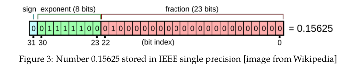
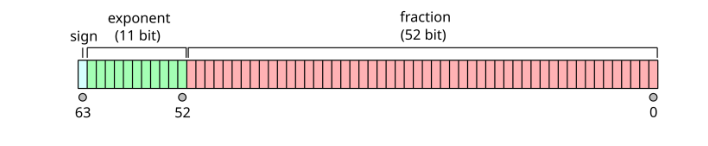

### Sect. 1 - Computer Arithmetic

Any nonzero decimal number $x$ :

$$
x = \sigma \cdot \bar{x} \cdot 10^e
$$

where 
$\sigma = \pm1$, $e \in \mathbb{Z}$, $1_{10} \leqslant \bar{x} \leqslant 10_{10}$
$\sigma$ is **sign**
$e$ is **exponent**
$\bar{x}$ is **mantissa** or **significant**

**Example 1** :

$$
27681.2 = (+1) \cdot 2.76812 \cdot 10^4 
$$

$\sigma = +1$
$\bar{x} = 2.76812$
$e = 4$

**Example 2** :

$$
-0.003134 = (-1) \cdot 3.134 \cdot 10^{-3} 
$$

$\sigma = -1$
$\bar{x} = 3.134$
$e = -3$

In the computer memory instead of storing the actual integer we store its values:
$e$, $\bar{x}$ and $e$ each of which has a fixed width

The number zero is represented uniquely by having both its **mantissa** and its **exponent** equal to **zero**

Formally, a floating point representation is characterized by four parameters: base $\beta$, which is a positive integer, precision $t$, which is the number of digits in mantissa, and the range for the exponent $e_\min ⩽e ⩽e_\max$. $t$ is precision.

$$
x = (\pm 1) \cdot \left(d_0 + \frac{d_1}{\beta} + \frac{d_2}{\beta^2} + \frac{d_3}{\beta^3} + \dots + \frac{d_t}{\beta^{t-1}}\right) \cdot \beta^e
$$

$$
x= (\pm 1) \cdot (d_0.d_1d_2d_3...d_t)_\beta \cdot \beta^e
$$

Today computers mostly use $(\beta = 2)$.

$$
x = \sigma \cdot \bar{x} \cdot 2^e
$$

**Example 1**
Let x = $(100101.011)_2$ Then the representation is:

$$
(100101.011)_2 = (+1)\cdot(1.00101011)_2\cdot2^{(101)_2}
$$

Consider the binary format for decimal number $(0.1)_{10} = (0.000110011001100\dots)_2$ the representation is :

$$
(0.000110011001100)_2 = (+1)\cdot(1.10011001100\dots)_2\cdot2^{(100)_2}
$$

Notice, that since $1_{10} \leqslant\bar{x}<(2)_{10}$, in the binary floating point representation the leading bit always equals 1.

IEEE SP, $e = 1$ bytes (8 bits), $t = 24 ,(23)$ bits and $\sigma = 1$ bit
IEEE DP, $e = 4$ bytes (32 bits), $t = 23$ bits and $\sigma = 1$ bit

### Sect. 1.1 IEEE SP Standard

$$
E = e + 127
$$

0 is stored in a special way:
$E = 0$
$\sigma = 0$
$\bar{x} = 0.00\dots$

$+\infty$ is sorted in a special way:
$E = 255$
$\sigma = 0$
$\bar{x} = 0.00\dots$

$-\infty$ is sorted in a special way:
$E = 255$
$\sigma = 1$
$\bar{x} = 0.00\dots$

*NaN* is sorted in a special way:
$E = 255$
$\bar{x} \neq 0.00\dots$
### Sect. 1.2 IEEE DP Standard

### Sect. 1.3 Accuracy of floating point representation

1. $0 < x \leq M$ and $x$ an integer implies $fl(x) = x$
2. $fl(M+1) \neq M+1$ 

For IEEE SP standard the integer M is $2^{24}$ because 

$$
2^{24} = (1.00\dots00)_2\cdot2^{24}
$$

Next integer $2^{24} + 1$ cannot be stored exactly since its mantissa will contain 24 + 1 binary digits:

$$
2^{24} + 1 = (1.\underbrace{00\dots0}_{23 \text{ zeros}}1)_2 \cdot 2^{24}
$$

For IEEE SP integer $M = 2^{24} = 16777216$ and for IEEE DP integer is $M = 2^{53} \approx 9.0 \cdot 10^{15}$ . 

Another parameter widely used to measure the accuracy of a floating point representation is the so-called **machine epsilon** $\Large{\varepsilon}$ , defined as the difference between 1 and the smallest number presentable in the machine arithmetic that is greater than 1.

$$
y = 1 + 23^{-23} = (1.\underbrace{00\dots0}_{22\text{ zeros}}1)_2 \cdot2^0 > 1
$$

and the machine epsilon in IEEE SP is:

$$
\varepsilon = y-1=2^{-23}\approx1.19\cdot10^{-7}
$$

In the case of IEEE double precision the machine epsilon is:

$$
\varepsilon = 2^{-52}\approx2.22\cdot10^{-16}
$$

### Sect. 1.4 Chopping and rounding

Let us first consider these concepts with decimal arithmetic. We write a computer floating point number $x$ and if precision $t = n$ (number of digits) we must shorten it to fit within the computer. This is done by either **chopping** or **rounding**.

The floating point **chopped**:

$$
fl(x) = \sigma\cdot\bar{x}\cdot10^e\equiv\sigma\cdot(a_1.a_2\dots a_n)_{10}\cdot10^e
$$

The floating point **rounded**:

$$
fl(x) = \begin{cases}
\sigma\cdot(a_1.a_2\dots a_n)_{10}\cdot10^e, & \mbox{if} & a_{n+1} < 5 \\
\sigma\cdot(a_1.a_2\dots a_n)_{10}\cdot10^e + (0.00\dots01)_{10}, & \mbox{if} & a_{n+1} \geq 5
\end{cases}
$$

Now lets consider them in binary floating point representations:

The floating point **chopped**:

$$
fl(x) = \sigma\cdot\bar{x}\cdot2^e\equiv\sigma\cdot(a_1.a_2\dots a_n)_{2}\cdot2^e
$$

The floating point **rounded**:

$$
fl(x) = \begin{cases}
\sigma\cdot(a_1.a_2\dots a_n)_{2}\cdot2^e, & \mbox{if} & a_{n+1} = 0 \\
\sigma\cdot(a_1.a_2\dots a_n)_{2}\cdot2^e + (0.00\dots01)_{2}, & \mbox{if} & a_{n+1} = 1
\end{cases}
$$

The error $x - fl(x) = 0$ when $x$ is stored exactly the same.

Consider the case $x > 0$ ($\sigma = +1$). With $x \neq fl(x)$, and using chopping calculations, we have always $fl(x) < x$ and therefore the error is always positive.

With $x \neq fl(x)$ and rounding being used the error is for half of the values is negative and for the other half is positive this is in our advantage because when we make several calculations the cutting method is always accumulating error where in rounding this error sometimes gets canceled by the opposite $\sigma$ value.

If we define $\Large\epsilon$ to be the negative of **relative error**:

$$
\epsilon = \frac{x - fl(x)}{x}
$$

This can be expanded to obtain 

$$
fl(x) = (1+\epsilon)x
$$

For bounds on relative error $\Large\epsilon$ :

$$
\large
\begin{array}
-\frac{1}{2^n} \leq \epsilon \leq \frac{1}{2n} & \mbox{if rounding is used}\\
-\frac{1}{2^{n-1}} \leq \epsilon \leq 0 & \mbox{if chopping is used}
\end{array}
$$

Observe that **chopping** introduces double the error on each number. 